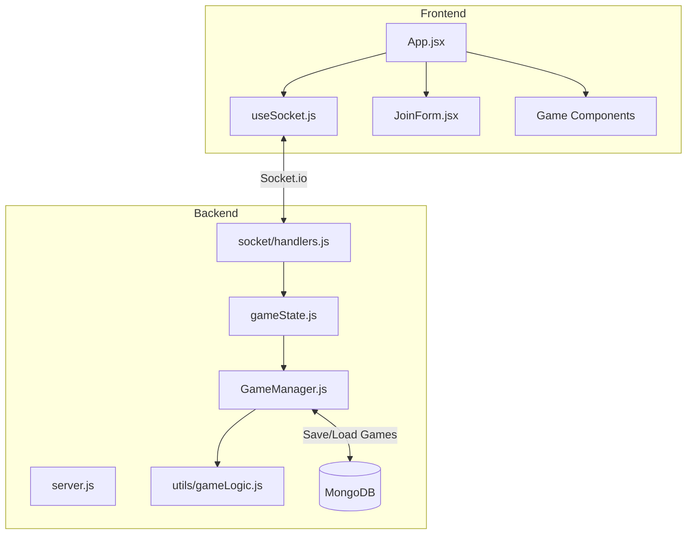
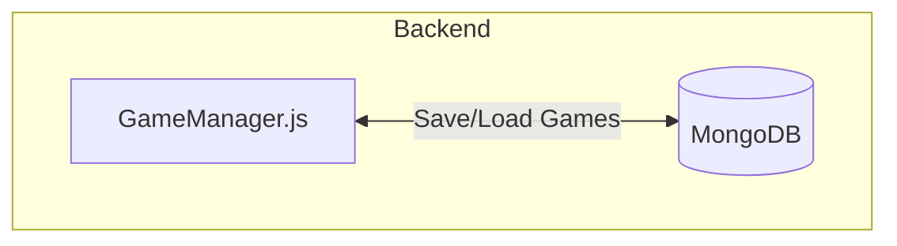
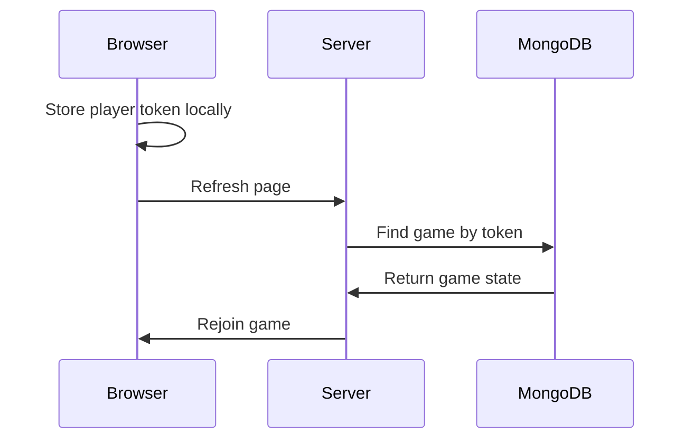
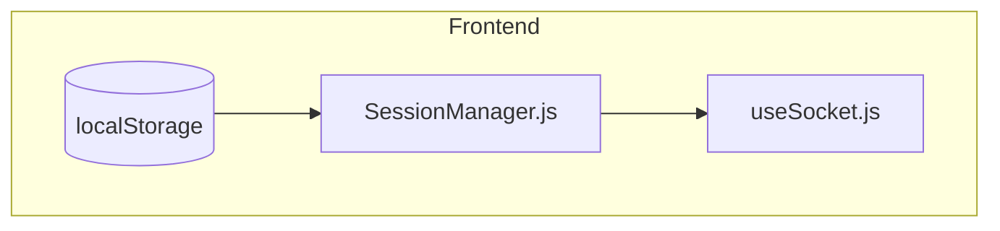
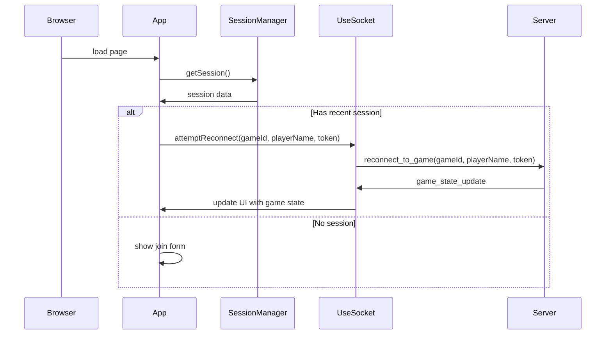

# Anagrab Persistence Plan

## Overview

This document outlines a comprehensive plan for implementing persistence in the Anagrab game application. The plan addresses two key requirements:

1. **Server Restart Resilience** - Ensuring game state survives server restarts on Render
2. **Client Refresh Support** - Allowing players to refresh their browsers and rejoin active games

## Current Architecture Analysis



### Current Implementation Limitations

1. **In-Memory Game Storage**: All game data is currently stored in-memory in the `GameManager` class, making it vulnerable to server restarts
2. **Socket-Based Player Identification**: Players are identified by their socket IDs, which change when reconnecting
3. **No Persistence Layer**: No mechanism exists to save or restore game states
4. **No Player Session Management**: No way to associate a returning player with their previous game state

## Implementation Phases

### Phase 1: MongoDB Integration & Basic Persistence

**Goal**: Games survive server restarts
**Verifiable Improvements**:

- Games persist after server restart
- Games load correctly when server comes back up
- No data loss during saves

**User Impact**:

- Games no longer lost on server restarts
- Players can return to games even after deployment
- Game history preserved

### Phase 2: Player Identity & Session Management

**Goal**: Players maintain identity across sessions
**Verifiable Improvements**:

- Players automatically rejoin their games on refresh
- Player scores/words preserved across reconnects
- Multiple tabs/windows handled correctly

**User Impact**:

- Browser refresh doesn't disrupt gameplay
- No more "player left the game" on accidental refresh
- Seamless experience across connection drops

### Phase 3: Cleanup & Performance

**Goal**: Efficient game management and cleanup
**Verifiable Improvements**:

- Old games automatically archived
- Server memory usage remains stable
- Quick game state loading

**User Impact**:

- Faster game loads
- More reliable performance
- No stale games cluttering the UI

## Technical Implementation

### MongoDB Schema

```javascript
{
  _id: "GAME_CODE",
  host: "player_token",
  players: {
    "player_token": {  // Use token as key instead of socketId
      name: "Player Name",
      words: ["WORD1", "WORD2"],
      lastSeen: ISODate()
    }
  },
  pot: ["A", "B", "C"],
  deck: ["D", "E", "F"],
  isActive: true,
  createdAt: ISODate(),
  lastActivity: ISODate()
}
```

### Socket Management

```javascript
// In-memory mappings for socket communication
socketToToken = new Map(); // socket.id -> player_token
tokenToSocket = new Map(); // player_token -> socket.id
```

### Key Technical Decisions

1. **Player Identification**:

   - Generate persistent player tokens stored in browser
   - Token replaces socket ID as player identifier
   - Socket IDs only used for real-time communication

2. **Game State Management**:

   - Keep active games in memory for performance
   - Sync to MongoDB on state changes
   - Load from MongoDB on server restart

3. **Cleanup Strategy**:

   - Archive games after 24h of inactivity
   - Remove games from memory if all players inactive >5min
   - Keep archived games for stats/history

4. **Error Handling**:
   - Graceful fallback to new game if rejoin fails
   - Clear feedback to players on connection status
   - Automatic retry on MongoDB connection issues

## Server-Side Persistence Solution

### 1. Database Integration



**Implementation Options:**

1. **File-based Storage**:

   - Simple JSON file storage for game states
   - Good for small-scale deployments
   - Low overhead, easy implementation

2. **Database Storage**:
   - MongoDB for document-based storage
   - Redis for in-memory data structure with persistence
   - Better for scaling and more complex data relationships

**Recommendation:** Start with file-based storage and migrate to Redis or MongoDB if needed.

### 2. Persistent Player Identity



**Key Components:**

- Generate persistent player tokens stored in localStorage on the client
- Map player tokens to game state on the server
- Allow players to reconnect using their token

## Client-Side Persistence Solution

### 1. Client Session Management



**Implementation:**

```javascript
// SessionManager.js (simplified)
export const storeSession = (gameId, playerName, token) => {
  localStorage.setItem(
    'gameSession',
    JSON.stringify({
      gameId,
      playerName,
      token,
      timestamp: Date.now(),
    })
  );
};

export const getSession = () => {
  const data = localStorage.getItem('gameSession');
  if (!data) return null;

  const session = JSON.parse(data);
  // Only return if less than 24h old
  return Date.now() - session.timestamp < 24 * 60 * 60 * 1000 ? session : null;
};
```

### 2. Automatic Reconnection Flow



## Backend Implementation Plan

### 1. Create a Persistence Manager

```javascript
// PersistenceManager.js
const fs = require('fs').promises;
const path = require('path');

class PersistenceManager {
  constructor(storageDir = './data') {
    this.gamesPath = path.join(storageDir, 'games.json');
    this.playersPath = path.join(storageDir, 'players.json');
    this.ensureStorageDir(storageDir);
  }

  async ensureStorageDir(dir) {
    try {
      await fs.mkdir(dir, { recursive: true });
    } catch (err) {
      console.error(`Error creating storage directory: ${err.message}`);
    }
  }

  async saveGames(games) {
    try {
      // Convert Map to serializable object
      const serializedGames = {};
      for (const [gameId, game] of games.entries()) {
        serializedGames[gameId] = game;
      }
      await fs.writeFile(this.gamesPath, JSON.stringify(serializedGames, null, 2));
    } catch (err) {
      console.error(`Error saving games: ${err.message}`);
    }
  }

  async loadGames() {
    try {
      const data = await fs.readFile(this.gamesPath, 'utf8');
      const games = new Map();
      const loadedGames = JSON.parse(data);

      for (const gameId in loadedGames) {
        games.set(gameId, loadedGames[gameId]);
      }

      return games;
    } catch (err) {
      if (err.code === 'ENOENT') {
        // File doesn't exist yet, return empty map
        return new Map();
      }
      console.error(`Error loading games: ${err.message}`);
      return new Map();
    }
  }

  async savePlayers(playerMap) {
    try {
      await fs.writeFile(this.playersPath, JSON.stringify(Object.fromEntries(playerMap), null, 2));
    } catch (err) {
      console.error(`Error saving player data: ${err.message}`);
    }
  }

  async loadPlayers() {
    try {
      const data = await fs.readFile(this.playersPath, 'utf8');
      return new Map(Object.entries(JSON.parse(data)));
    } catch (err) {
      if (err.code === 'ENOENT') {
        return new Map();
      }
      console.error(`Error loading player data: ${err.message}`);
      return new Map();
    }
  }
}

module.exports = { PersistenceManager };
```

### 2. Modify GameManager for Persistence

```javascript
// Modifications to GameManager.js
const { MongoClient } = require('mongodb');

class GameManager {
  constructor() {
    this.games = new Map(); // In-memory cache
    this.client = new MongoClient(process.env.MONGODB_URI);
    this.connect();
  }

  async connect() {
    await this.client.connect();
    this.db = this.client.db('anagrab');
    this.gamesCollection = this.db.collection('games');
    await this.loadGames();
  }

  async loadGames() {
    const games = await this.gamesCollection
      .find({
        createdAt: { $gt: new Date(Date.now() - 24 * 60 * 60 * 1000) }, // Last 24h only
      })
      .toArray();

    games.forEach(game => this.games.set(game._id, game));
  }

  async saveGame(gameId) {
    const game = this.games.get(gameId);
    if (game) {
      await this.gamesCollection.updateOne({ _id: gameId }, { $set: game }, { upsert: true });
    }
  }

  // Simplified player reconnection
  async reconnectPlayer(token, socketId, gameId) {
    const game = this.games.get(gameId);
    if (!game) return false;

    // Find player by token
    const playerEntry = Object.entries(game.players).find(([_, player]) => player.token === token);

    if (playerEntry) {
      const [oldSocketId, playerData] = playerEntry;
      // Update socket ID
      game.players[socketId] = playerData;
      delete game.players[oldSocketId];
      await this.saveGame(gameId);
      return true;
    }
    return false;
  }
}
```

## Frontend Implementation Plan

### 1. Modify useSocket.js for Reconnection

```javascript
// Modifications to useSocket.js
import { getPlayerToken, storeGameSession, getLastGameSession } from '../utils/SessionManager';

export const useSocket = () => {
  // Existing state variables...
  const [playerToken, setPlayerToken] = useState(() => getPlayerToken());

  // Handle reconnection on initial load
  useEffect(() => {
    const lastSession = getLastGameSession();

    if (lastSession && lastSession.gameId && lastSession.playerName) {
      // Only attempt reconnect if the session is less than 24 hours old
      const MAX_SESSION_AGE = 24 * 60 * 60 * 1000; // 24 hours
      const sessionAge = Date.now() - lastSession.timestamp;

      if (sessionAge < MAX_SESSION_AGE) {
        console.log('Attempting to reconnect to previous session:', lastSession);
        reconnectToGame(lastSession.gameId, lastSession.playerName);
      }
    }
  }, []);

  // Modified join game function to store session info
  const joinGame = (gameId, playerName) => {
    if (gameId && playerName.trim()) {
      console.log('[joinGame] Joining game:', { gameId, playerName, playerToken });
      socket.emit('join_game', { gameId, playerName, playerToken });
      storeGameSession(gameId, playerName);
      setIsJoined(true);
      setCurrentPlayer({ name: playerName });
      setCurrentGameId(gameId);
    }
  };

  // New function to reconnect to an existing game
  const reconnectToGame = (gameId, playerName) => {
    if (gameId && playerName && playerToken) {
      console.log('[reconnectToGame] Reconnecting to game:', { gameId, playerName, playerToken });
      socket.emit('reconnect_to_game', { gameId, playerName, playerToken });
      setCurrentGameId(gameId);
    }
  };

  // Rest of useSocket implementation...

  return {
    // Existing return values...
    reconnectToGame,
    playerToken,
  };
};
```

### 2. Add Reconnection Socket Events

```javascript
// Add to socket/handlers.js
socket.on('reconnect_to_game', ({ gameId, playerName, playerToken }) => {
  console.log('Player reconnecting:', { socketId: socket.id, playerName, gameId, playerToken });

  // Attempt to reconnect player using token
  const reconnected = gameManager.reconnectPlayer(playerToken, socket.id, gameId);

  if (reconnected) {
    // Join the socket to the game room
    socket.join(gameId);

    // Get the game state
    const game = gameManager.getGame(gameId);

    // Send success response and current game state
    socket.emit('reconnection_successful', { gameId, playerName });
    io.to(gameId).emit('game_state_update', game);
  } else {
    // Reconnection failed
    socket.emit('reconnection_failed', {
      message: 'Unable to reconnect to the game. The game may have ended or your session expired.',
    });
  }
});
```

## Conclusion

This persistence plan addresses both server restart resilience and client refresh support through a combination of:

1. Server-side persistent storage of game states
2. Client-side session management with persistent tokens
3. Reconnection protocols for seamless player experience

The implementation can start with simple file-based storage and evolve to more robust database solutions as needed. This approach minimizes development time while meeting the core requirements.

## Game Document Schema

```
{
  _id: "GAME_CODE",  // 4 letter code
  host: "player_token",
  players: {
    "player_token": {
      name: "Player Name",
      words: ["WORD1", "WORD2"],
      lastSeen: ISODate()
    }
  },
  pot: ["A", "B", "C"],
  deck: ["D", "E", "F"],
  isActive: true,
  createdAt: ISODate(),
  lastActivity: ISODate()
}
```
