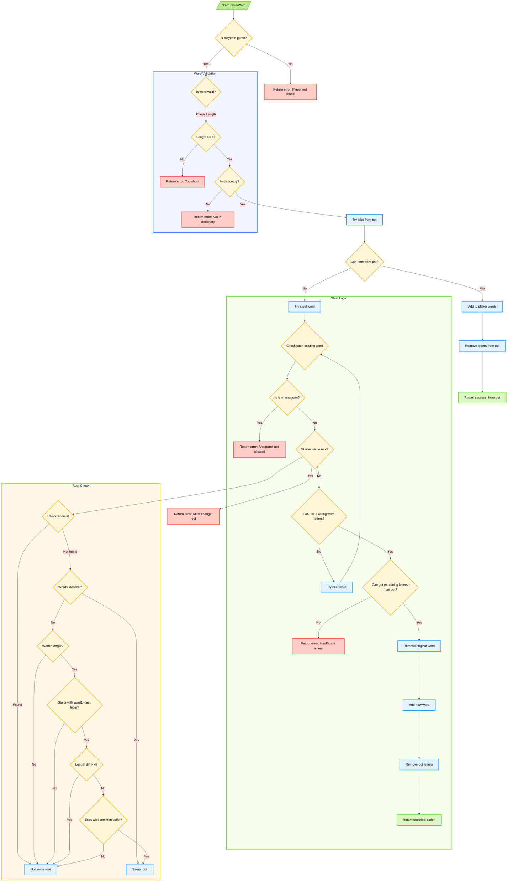

```mermaid
%%{init: {
  'theme': 'base',
  'themeVariables': {
    'primaryColor': '#e1f3ff',
    'primaryTextColor': '#000',
    'primaryBorderColor': '#7C0000',
    'lineColor': '#384049',
    'secondaryColor': '#ffd7d7',
    'tertiaryColor': '#fff5d8'
  }
}}%%

flowchart TD
    %% Main Flow
    classDef start fill:#b7eb8f,stroke:#82c91e,stroke-width:2px
    classDef error fill:#ffccc7,stroke:#ff4d4f,stroke-width:2px
    classDef success fill:#d9f7be,stroke:#52c41a,stroke-width:2px
    classDef process fill:#e1f3ff,stroke:#1890ff,stroke-width:2px
    classDef condition fill:#fff5d8,stroke:#faad14,stroke-width:2px

    A[/Start: claimWord/]:::start --> B{Is player in game?}:::condition
    B -->|No| C[Return error: Player not found]:::error
    B -->|Yes| D{Is word valid?}:::condition

    %% Word Validation Section
    subgraph Word_Validation[Word Validation]
        direction TB
        D -->|Check Length| D1{Length >= 4?}:::condition
        D1 -->|No| D2[Return error: Too short]:::error
        D1 -->|Yes| D3{In dictionary?}:::condition
        D3 -->|No| D4[Return error: Not in dictionary]:::error
    end

    %% Pot Check Flow
    D3 -->|Yes| E[Try take from pot]:::process
    E --> F{Can form from pot?}:::condition
    F -->|Yes| G[Add to player words]:::process
    G --> H[Remove letters from pot]:::process
    H --> I[Return success: from pot]:::success

    F -->|No| J[Try steal word]:::process

    %% Steal Logic Section
    subgraph Steal_Logic[Steal Logic]
        direction TB
        J --> K{Check each existing word}:::condition
        K --> L{Is it an anagram?}:::condition
        L -->|Yes| M[Return error: Anagrams not allowed]:::error
        L -->|No| N{Shares same root?}:::condition
        N -->|No| P{Can use existing word letters?}:::condition
        P -->|No| Q[Try next word]:::process
        Q --> K
        P -->|Yes| R{Can get remaining letters from pot?}:::condition
        R -->|No| S[Return error: Insufficient letters]:::error
        R -->|Yes| T[Remove original word]:::process
        T --> U[Add new word]:::process
        U --> V[Remove pot letters]:::process
        V --> W[Return success: stolen]:::success
    end

    %% Root Check Section
    subgraph Root_Check[Root Check]
        direction LR
        N --> N1{Check whitelist}:::condition
        N1 -->|Found| N2[Not same root]:::process
        N1 -->|Not found| N3{Words identical?}:::condition
        N3 -->|Yes| N4[Same root]:::process
        N3 -->|No| N5{Word2 longer?}:::condition
        N5 -->|No| N2
        N5 -->|Yes| N6{Starts with word1 - last letter?}:::condition
        N6 -->|No| N2
        N6 -->|Yes| N7{Length diff > 4?}:::condition
        N7 -->|Yes| N2
        N7 -->|No| N8{Ends with common suffix?}:::condition
        N8 -->|Yes| N4
        N8 -->|No| N2
    end

    %% Connect Root Check back to main flow
    N -->|Yes| O[Return error: Must change root]:::error

    %% Style Subgraphs
    style Word_Validation fill:#f0f5ff,stroke:#1890ff,stroke-width:2px
    style Steal_Logic fill:#f6ffed,stroke:#52c41a,stroke-width:2px
    style Root_Check fill:#fff7e6,stroke:#faad14,stroke-width:2px
```
