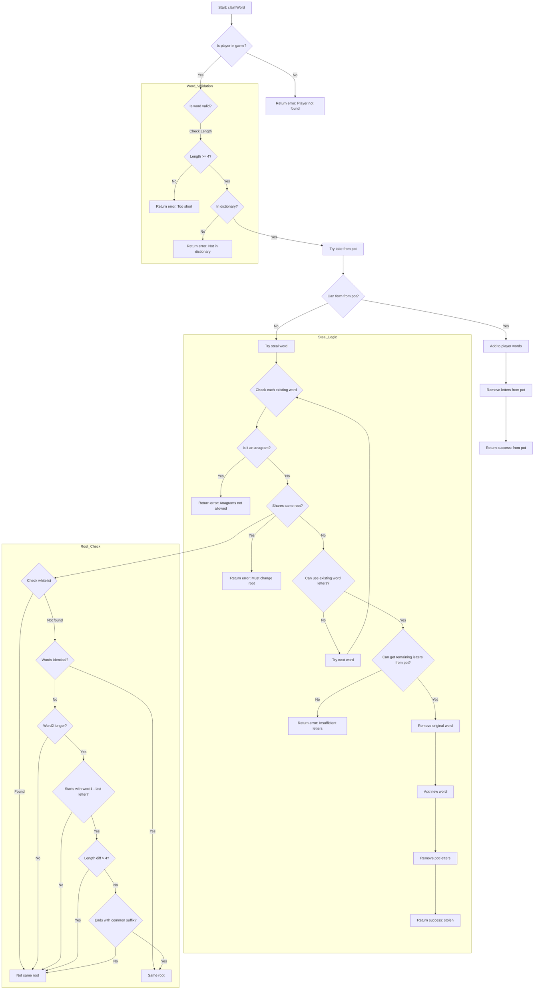

```mermaid
flowchart TD
    A[Start: claimWord] --> B{Is player in game?}
    B -->|No| C[Return error: Player not found]
    B -->|Yes| D{Is word valid?}

    subgraph Word_Validation
        D -->|Check Length| D1{Length >= 4?}
        D1 -->|No| D2[Return error: Too short]
        D1 -->|Yes| D3{In dictionary?}
        D3 -->|No| D4[Return error: Not in dictionary]
    end

    D3 -->|Yes| E[Try take from pot]
    E --> F{Can form from pot?}
    F -->|Yes| G[Add to player words]
    G --> H[Remove letters from pot]
    H --> I[Return success: from pot]

    F -->|No| J[Try steal word]

    subgraph Steal_Logic
        J --> K{Check each existing word}
        K --> L{Is it an anagram?}
        L -->|Yes| M[Return error: Anagrams not allowed]
        L -->|No| N{Shares same root?}
        N -->|Yes| O[Return error: Must change root]
        N -->|No| P{Can use existing word letters?}
        P -->|No| Q[Try next word]
        Q --> K
        P -->|Yes| R{Can get remaining letters from pot?}
        R -->|No| S[Return error: Insufficient letters]
        R -->|Yes| T[Remove original word]
        T --> U[Add new word]
        U --> V[Remove pot letters]
        V --> W[Return success: stolen]
    end

    subgraph Root_Check
        N --> N1{Check whitelist}
        N1 -->|Found| N2[Not same root]
        N1 -->|Not found| N3{Words identical?}
        N3 -->|Yes| N4[Same root]
        N3 -->|No| N5{Word2 longer?}
        N5 -->|No| N2
        N5 -->|Yes| N6{Starts with word1 - last letter?}
        N6 -->|No| N2
        N6 -->|Yes| N7{Length diff > 4?}
        N7 -->|Yes| N2
        N7 -->|No| N8{Ends with common suffix?}
        N8 -->|Yes| N4
        N8 -->|No| N2
    end
```
