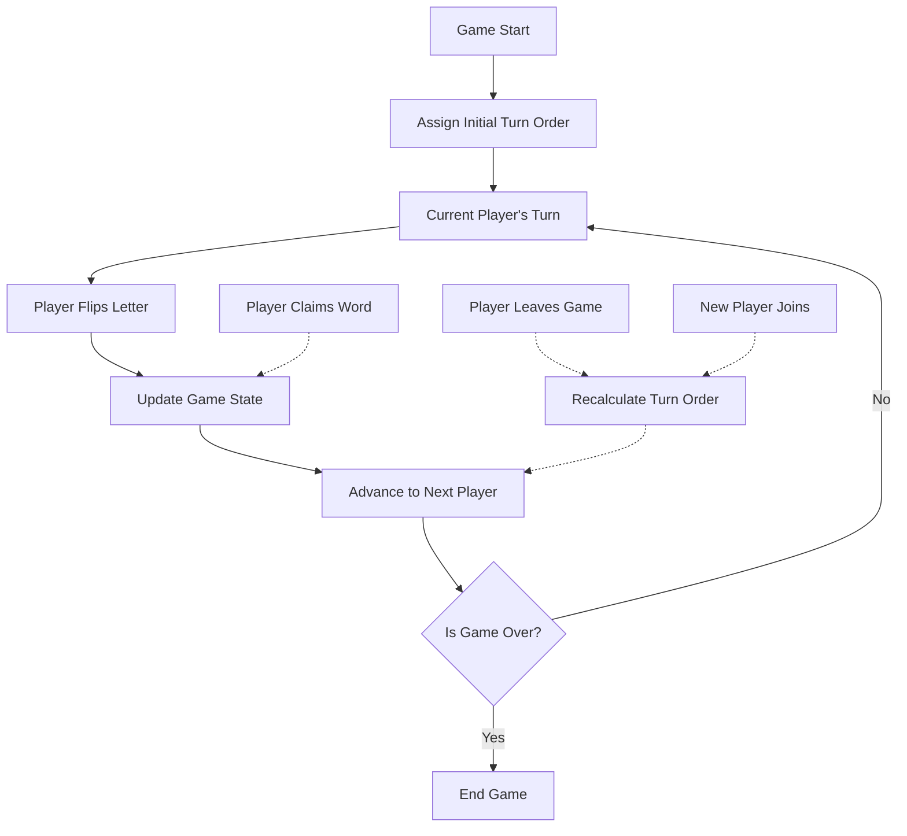
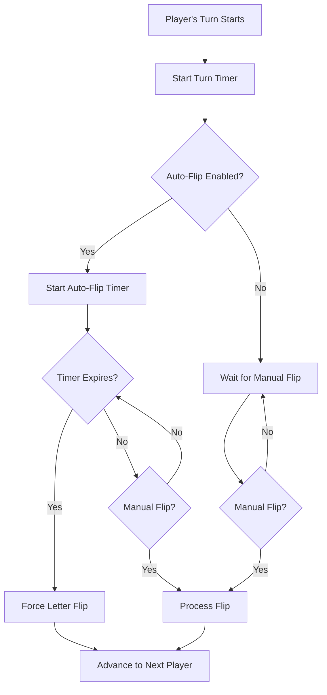

# Turn-Based Flipping and Auto-Flip Feature Proposal

## Overview

This document outlines the implementation plan for adding two new features to the Anagrab game in two distinct phases:

### Phase 1: Turn-Based Flipping

A structured approach where players take turns flipping letters, ensuring fair participation.

### Phase 2: Auto-Flip Enhancement

An enhancement to turn-based flipping that adds a time management aspect to player turns.

These features aim to enhance gameplay by providing more structure, fairness, and flexibility in how letters are revealed during the game.

## Current Implementation

Currently, the game allows any player to flip a letter at any time by clicking the "Flip Letter" button. This can lead to:

- Dominant players controlling the pace of the game
- Uneven participation
- Potential confusion about whose turn it is to flip
- Periods of inactivity if players are hesitant to flip

## Phase 1: Turn-Based Flipping Implementation

### Core Mechanics

### Key Components

1. **Turn Order Management**:

   - Track player order in an array
   - Keep index of current player
   - Auto-advance after each flip
   - Skip offline players automatically

2. **Game State Updates**:

   - Track current and next player
   - Show visual turn indicators
   - Handle player joins/disconnects
   - Monitor player connection status

3. **Offline Player Handling**:
   - Detect player disconnection events
   - Auto-skip offline players after brief grace period (5 seconds)
   - Re-include players when they reconnect
   - Visual indicator for offline players
   - Maintain turn order when players return

### Technical Implementation

#### Backend Changes

1. **Game Class Updates**:

   - Add turn order tracking
   - Modify flip logic to respect turns
   - Add player order management
   - Add connection status tracking
   - Implement offline player detection and handling

2. **Socket Events**:
   - Get current turn
   - Handle turn transitions
   - Player join/leave events
   - Track disconnect/reconnect events
   - Handle grace period timeouts

#### Frontend Changes

1. **UI Updates**:
   - Turn indicator
   - Current player highlight
   - Next player preview
   - Updated flip button state
   - Offline status indicators
   - Reconnection notifications

#### Migration Steps

1. Implement turn order tracking in Game class
2. Add turn-based restrictions to letter flipping
3. Update frontend to show turn information
4. Test with multiple players
5. Deploy and monitor

## Phase 2: Auto-Flip Enhancement

### Core Mechanics

### Future Implementation (Phase 2)

1. **Turn Timer Enhancement**:

   - Add configurable timer to each player's turn (default: 15 seconds)
   - Timer starts when player's turn begins
   - Player can flip manually at any time during their turn
   - If timer expires, automatic flip occurs

2. **Settings**:

   - Toggle for auto-flip timer
   - Configurable timer duration
   - Host-only controls
   - Visual timer countdown for current player

3. **Game Flow**:

   - Players maintain their turns as in Phase 1
   - During their turn, players can:
     - Flip manually at any time
     - Wait for auto-flip if timer expires
   - Turn advances after any flip (manual or automatic)
   - Timer resets with each new turn
   - For offline players:
     - Short grace period (5 seconds) when disconnection detected
     - Auto-flip triggers immediately after grace period
     - If player reconnects during grace period, their turn continues
     - Visual indicator shows offline status and grace period countdown

4. **Technical Considerations**:
   - Server-side timer management
   - Synchronization between clients
   - Graceful handling of network delays
   - Clear visual feedback for timer status
   - Robust offline player detection
   - Efficient turn skipping for offline players
   - Proper handling of reconnection edge cases

## Conclusion

This phased approach will allow us to:

1. First establish a fair and structured turn-based system
2. Later enhance turns with optional auto-flip timing
3. Maintain player agency while preventing stalled games
4. Provide flexibility in gameplay styles
5. Handle network issues and disconnections gracefully

The auto-flip enhancement will work seamlessly with the turn-based system, adding a time management aspect while preserving the core turn structure. This ensures games maintain momentum while still giving players control over their turns, even in the presence of network issues or disconnected players.
