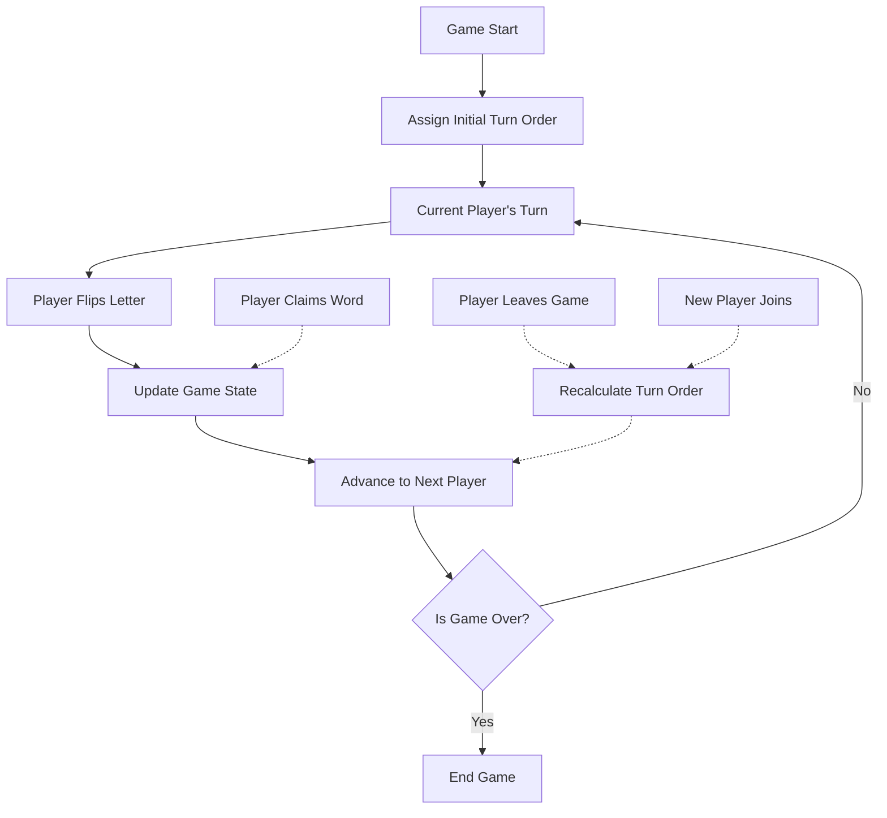
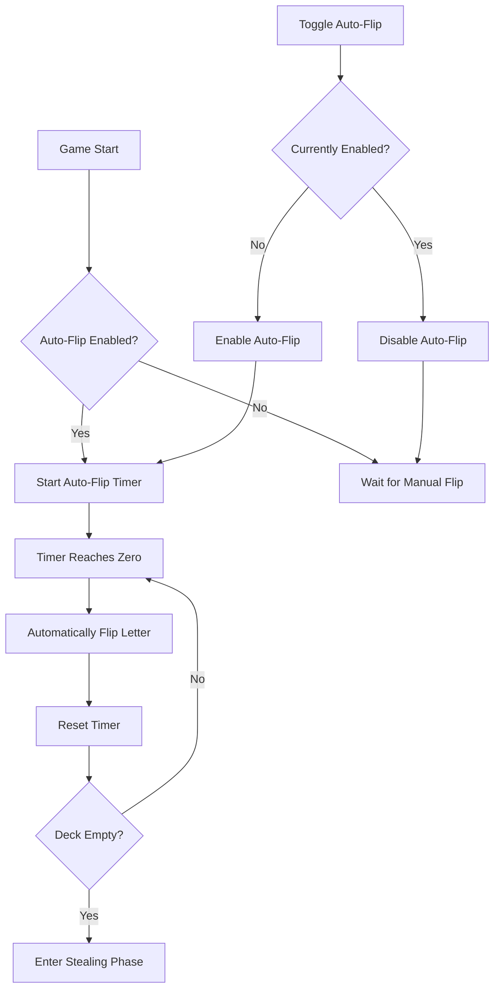
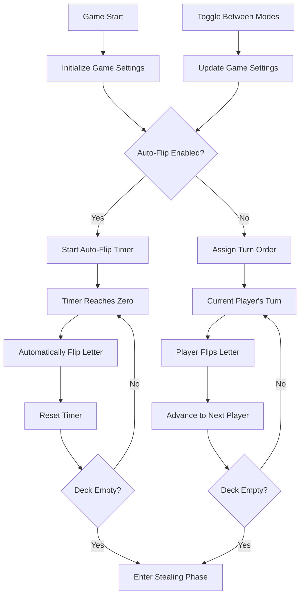

# Turn-Based Flipping and Auto-Flip Feature Proposal

## Overview

This document outlines the implementation plan for adding two new features to the Anagrab game:

1. **Turn-Based Flipping**: A structured approach where players take turns flipping letters, ensuring fair participation.
2. **Auto-Flip Option**: An automated system that flips letters at regular intervals, maintaining game momentum.

These features aim to enhance gameplay by providing more structure, fairness, and flexibility in how letters are revealed during the game.

## Current Implementation

Currently, the game allows any player to flip a letter at any time by clicking the "Flip Letter" button. This can lead to:

- Dominant players controlling the pace of the game
- Uneven participation
- Potential confusion about whose turn it is to flip
- Periods of inactivity if players are hesitant to flip

## Proposed Changes

### 1. Turn-Based Flipping

#### Core Mechanics



#### Implementation Details

1. **Turn Order Management**:

   - Store the turn order as an array of player tokens in the Game class
   - Track the current player's index in the turn order
   - Automatically advance to the next player after a flip

2. **Game State Updates**:

   - Add `currentTurn` property to the game state
   - Add `nextTurn` property to show who's up next
   - Add visual indicators in the UI for whose turn it is

3. **Edge Cases**:
   - **Player Disconnects**: Automatically skip disconnected players
   - **Player Rejoins**: Insert them back into the turn order
   - **Inactivity**: Optional timeout to auto-advance if a player is inactive

### 2. Auto-Flip Feature

#### Core Mechanics



#### Implementation Details

1. **Auto-Flip Settings**:

   - Add `autoFlipEnabled` boolean to game settings
   - Add `autoFlipInterval` (in seconds) to game settings
   - Default values: `false` and `15` seconds

2. **Timer Management**:

   - Server-side timer to ensure consistency
   - Countdown visible to all players
   - Reset timer after each flip (manual or automatic)

3. **User Controls**:
   - Toggle button to enable/disable auto-flip
   - Slider or input to adjust the interval (host only)
   - Visual indicator showing auto-flip status

### 3. Combined Implementation



## Technical Implementation Plan

### Backend Changes

1. **Game Class Updates**:

   ```javascript
   // Add to Game constructor
   this.turnOrder = [];
   this.currentTurnIndex = 0;
   this.settings = {
     ...settings,
     autoFlipEnabled: settings.autoFlipEnabled || false,
     autoFlipInterval: settings.autoFlipInterval || 15,
   };
   this.autoFlipTimer = null;
   ```

2. **Turn Management Methods**:

   ```javascript
   // Initialize turn order
   initializeTurnOrder() {
     this.turnOrder = Object.keys(this.players);
     this.currentTurnIndex = 0;
     return this;
   }

   // Get current player's turn
   getCurrentTurn() {
     return this.turnOrder[this.currentTurnIndex];
   }

   // Advance to next player
   advanceToNextTurn() {
     this.currentTurnIndex = (this.currentTurnIndex + 1) % this.turnOrder.length;
     return this.getCurrentTurn();
   }

   // Handle player joining/leaving
   updateTurnOrder() {
     const currentPlayer = this.getCurrentTurn();
     this.turnOrder = Object.keys(this.players);

     // If current player still exists, keep their turn
     if (currentPlayer && this.turnOrder.includes(currentPlayer)) {
       this.currentTurnIndex = this.turnOrder.indexOf(currentPlayer);
     } else {
       this.currentTurnIndex = 0;
     }

     return this;
   }
   ```

3. **Auto-Flip Management**:

   ```javascript
   // Start auto-flip timer
   startAutoFlipTimer() {
     if (this.settings.autoFlipEnabled && !this.autoFlipTimer) {
       this.autoFlipTimer = setTimeout(() => {
         this.autoFlip();
       }, this.settings.autoFlipInterval * 1000);
     }
     return this;
   }

   // Auto-flip a letter
   autoFlip() {
     const result = this.flipLetter();
     this.autoFlipTimer = null;

     if (result.success && this.deck.length > 0) {
       this.startAutoFlipTimer();
     }

     return result;
   }

   // Stop auto-flip timer
   stopAutoFlipTimer() {
     if (this.autoFlipTimer) {
       clearTimeout(this.autoFlipTimer);
       this.autoFlipTimer = null;
     }
     return this;
   }

   // Toggle auto-flip
   toggleAutoFlip(enabled, interval = null) {
     this.settings.autoFlipEnabled = enabled;

     if (interval !== null) {
       this.settings.autoFlipInterval = interval;
     }

     if (enabled) {
       this.startAutoFlipTimer();
     } else {
       this.stopAutoFlipTimer();
     }

     return this;
   }
   ```

4. **Modified Flip Letter Method**:
   ```javascript
   // Update flipLetter to handle turns
   flipLetter(socketId = null) {
     // In auto-flip mode, no turn checking
     if (this.settings.autoFlipEnabled || !socketId) {
       // Proceed with flip
     } else {
       // Check if it's this player's turn
       const playerToken = this.playerTokens.get(socketId);
       const currentTurn = this.getCurrentTurn();

       if (playerToken !== currentTurn) {
         return {
           success: false,
           error: "Not your turn to flip",
           state: this
         };
       }

       // Advance to next player after flip
       this.advanceToNextTurn();
     }

     // Existing flip logic
     if (this.deck.length > 0) {
       const letter = this.deck.pop();
       this.pot.push(letter);
       return { success: true, state: this };
     }

     return { success: false, state: this };
   }
   ```

### Socket Handler Updates

1. **New Socket Events**:

   ```javascript
   // Toggle auto-flip mode
   socket.on('toggle_auto_flip', async ({ gameId, enabled, interval }) => {
     try {
       const game = GameManager.getGame(gameId);
       if (game) {
         game.toggleAutoFlip(enabled, interval);
         await GameManager.saveGameToDB(game);
         io.to(gameId).emit('game_state_update', game);
       }
     } catch (error) {
       console.error('Error toggling auto-flip:', error);
     }
   });

   // Get whose turn it is
   socket.on('get_current_turn', gameId => {
     try {
       const game = GameManager.getGame(gameId);
       if (game) {
         const currentTurn = game.getCurrentTurn();
         const currentPlayer = game.players[currentTurn];

         socket.emit('turn_info', {
           currentTurn,
           playerName: currentPlayer?.name,
         });
       }
     } catch (error) {
       console.error('Error getting turn info:', error);
     }
   });
   ```

### Frontend Changes

1. **Game Controls Component Updates**:

   - Add turn indicator
   - Add auto-flip toggle and interval control
   - Disable flip button when it's not the player's turn

2. **New UI Elements**:
   - Turn indicator showing whose turn it is
   - Auto-flip status indicator
   - Settings panel for auto-flip configuration

## Migration Plan

1. **Phase 1: Backend Implementation**

   - Add turn management to Game class
   - Add auto-flip functionality
   - Update socket handlers
   - Add new socket events

2. **Phase 2: Frontend Implementation**

   - Update UI components
   - Add new controls and indicators
   - Implement client-side logic for turn management

3. **Phase 3: Testing**

   - Test turn-based flipping
   - Test auto-flip functionality
   - Test edge cases (players joining/leaving)

4. **Phase 4: Deployment**
   - Deploy backend changes
   - Deploy frontend changes
   - Monitor for issues

## Conclusion

The proposed turn-based flipping and auto-flip features will enhance the Anagrab game by providing more structure and flexibility in gameplay. These features address issues with the current free-for-all flipping system while maintaining the core game mechanics that make Anagrab enjoyable.

By implementing these features, we expect to see:

- More balanced participation from all players
- Clearer game flow and expectations
- Options to accommodate different play styles
- Reduced periods of inactivity

The implementation is designed to be backward compatible, allowing games to continue functioning with the current system while new games can opt into the new features.
