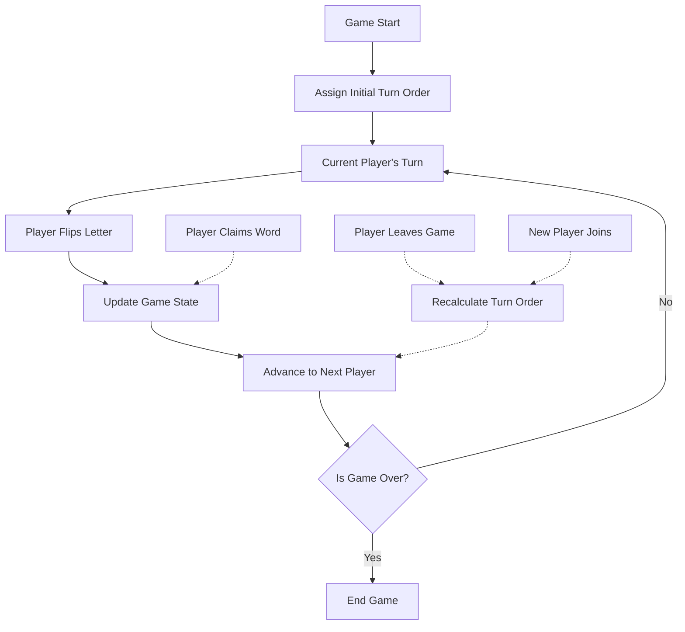
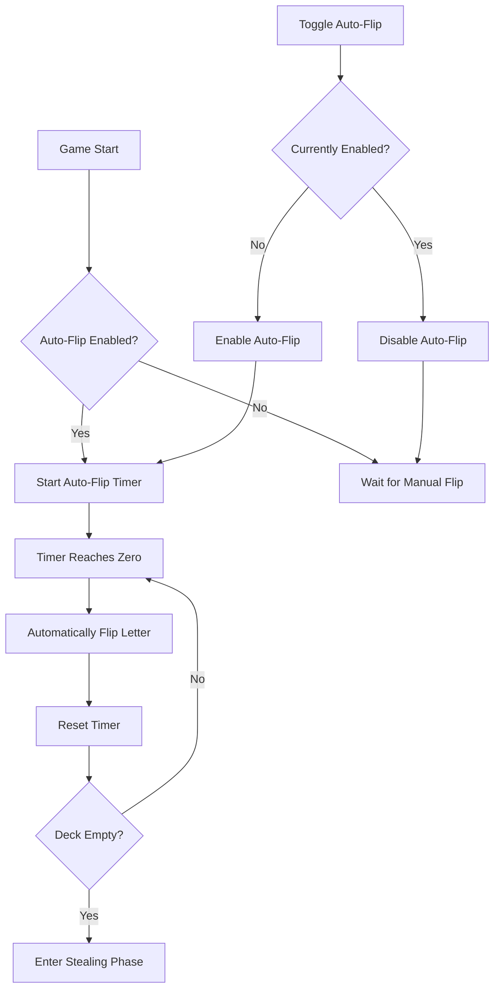

# Turn-Based Flipping and Auto-Flip Feature Proposal

## Overview

This document outlines the implementation plan for adding two new features to the Anagrab game in two distinct phases:

### Phase 1: Turn-Based Flipping

A structured approach where players take turns flipping letters, ensuring fair participation.

### Phase 2: Auto-Flip Option

An automated system that flips letters at regular intervals, maintaining game momentum.

These features aim to enhance gameplay by providing more structure, fairness, and flexibility in how letters are revealed during the game.

## Current Implementation

Currently, the game allows any player to flip a letter at any time by clicking the "Flip Letter" button. This can lead to:

- Dominant players controlling the pace of the game
- Uneven participation
- Potential confusion about whose turn it is to flip
- Periods of inactivity if players are hesitant to flip

## Phase 1: Turn-Based Flipping Implementation

### Core Mechanics

### Key Components

1. **Turn Order Management**:

   - Track player order in an array
   - Keep index of current player
   - Auto-advance after each flip

2. **Game State Updates**:
   - Track current and next player
   - Show visual turn indicators
   - Handle player joins/disconnects

### Technical Implementation

#### Backend Changes

1. **Game Class Updates**:

   - Add turn order tracking
   - Modify flip logic to respect turns
   - Add player order management

2. **Socket Events**:
   - Get current turn
   - Handle turn transitions
   - Player join/leave events

#### Frontend Changes

1. **UI Updates**:
   - Turn indicator
   - Current player highlight
   - Next player preview
   - Updated flip button state

#### Migration Steps

1. Implement turn order tracking in Game class
2. Add turn-based restrictions to letter flipping
3. Update frontend to show turn information
4. Test with multiple players
5. Deploy and monitor

## Phase 2: Auto-Flip Implementation (Future)

### Core Mechanics

### Future Implementation (Phase 2)

1. **Settings**:

   - Toggle for auto-flip
   - Configurable interval (default: 15 seconds)
   - Host-only controls

2. **Timer System**:
   - Server-side timer
   - Visual countdown
   - Auto-reset after flips

## Conclusion

This phased approach will allow us to:

1. First establish a fair and structured turn-based system
2. Gather feedback and improve turn-based mechanics
3. Later introduce auto-flip as an optional feature
4. Provide flexibility in gameplay styles

The immediate focus on turn-based flipping will address the core issues of participation balance and game flow, while setting up a solid foundation for future auto-flip functionality.
