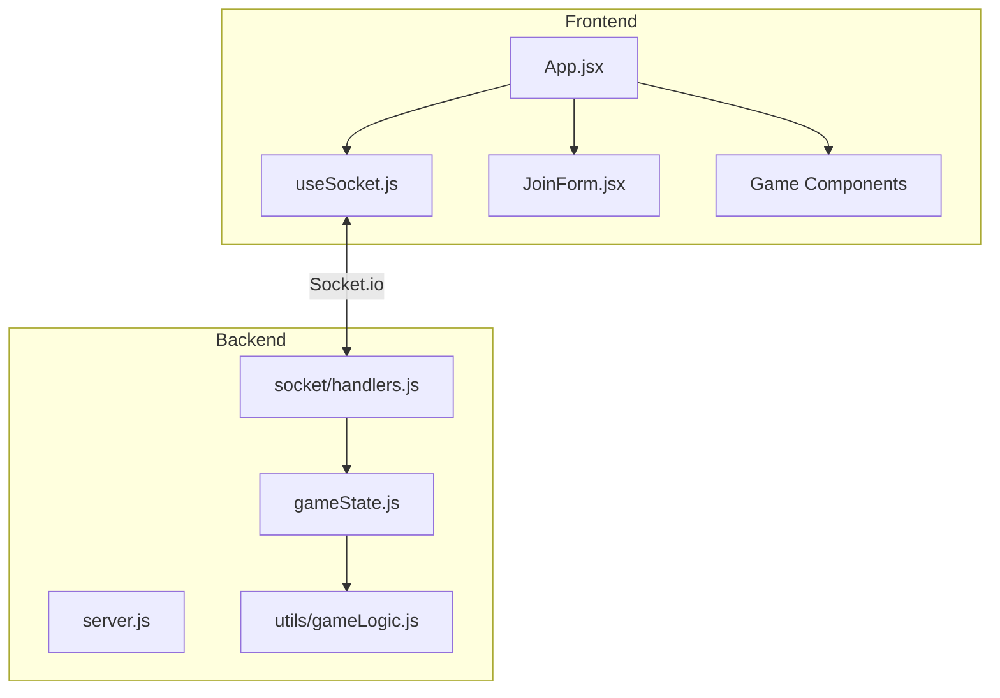
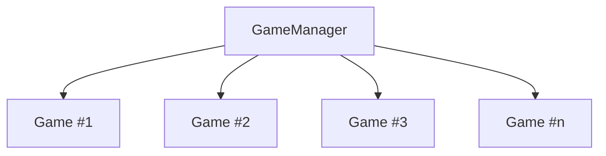
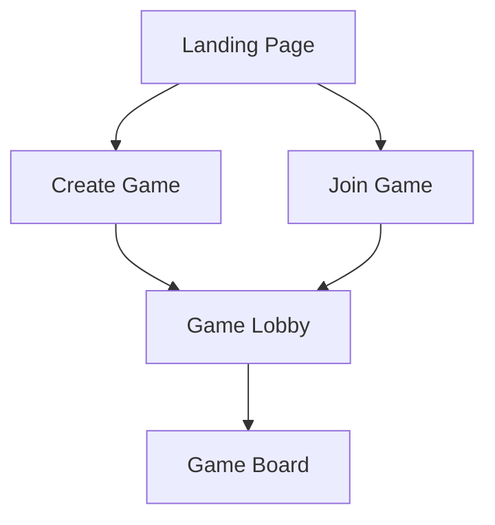
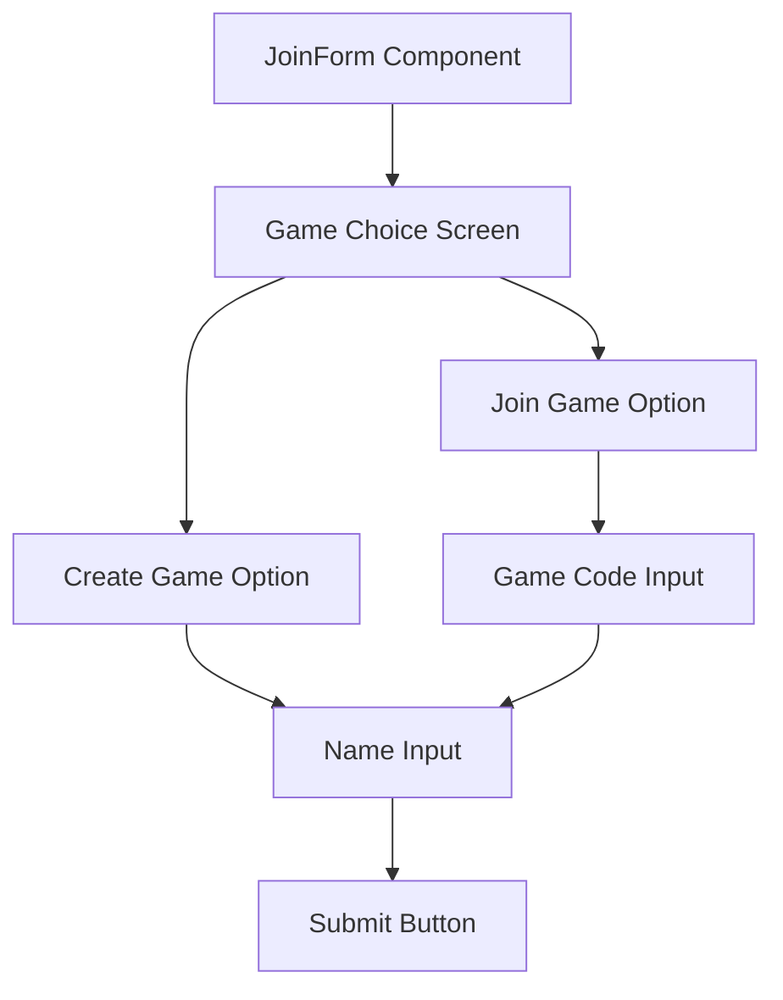
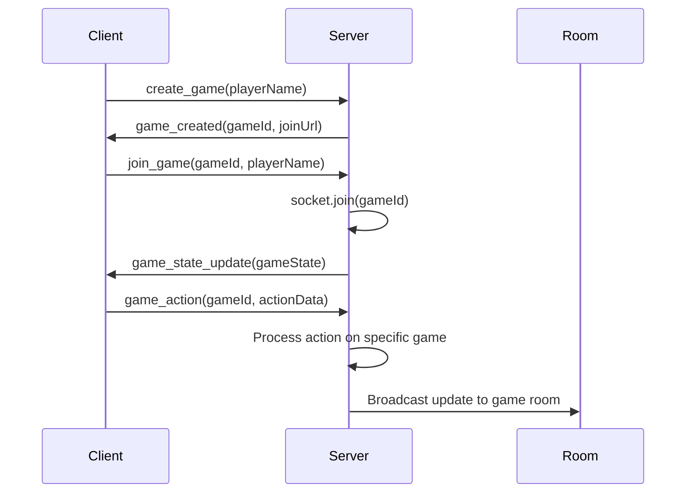

# Multi-Game Support Plan for Anagrab

## Overview

Currently, Anagrab supports a single global game that all players join. This document outlines the changes needed to support multiple concurrent games, allowing different groups of players to play separate instances of the game.

## Current Architecture



The current system uses:

- A single global game state object in `gameState.js`
- No concept of game rooms or IDs
- Players directly join the single global game through the JoinForm component
- The JoinForm component only collects a player's name before joining

### Current JoinForm Component

The current JoinForm.jsx is simple:

- Displays the "ANAGRAB" title with animated letter tiles
- Collects only the player's name
- Has a single "Join Game" button
- Calls the `onJoin` function with the player's name, which triggers the `joinGame` function in useSocket.js

## Server-Side Changes

### 1. Game State Management



- Replace the single `gameState` object with a `GameManager` class:
  - Store multiple game instances in a Map: `Map<gameId, GameState>`
  - Implement methods to create, retrieve, and delete game instances
  - Add functionality to clean up inactive/empty games

### 2. Game Room Implementation

- Add game creation functionality:

  ```javascript
  function createGame(hostSocketId, settings = {}) {
    const gameId = generateUniqueId();
    games.set(gameId, {
      id: gameId,
      host: hostSocketId,
      players: {},
      pot: [],
      deck: [],
      isActive: false,
      settings: settings,
      createdAt: Date.now(),
    });
    return gameId;
  }
  ```

- Modify player joining to include game ID:
  ```javascript
  function addPlayer(gameId, socketId, playerName) {
    const game = games.get(gameId);
    if (!game) return null;

    game.players[socketId] = {
      name: playerName,
      words: [],
    };
    return game;
  }
  ```

### 3. Socket Handler Updates

- Update socket handlers to handle game-specific events:
  - Add game creation event
  - Make all game actions require a gameId parameter
  - Implement Socket.io rooms for broadcasting to specific games only

## Frontend Changes

### 1. UI Updates



- Add a landing page with options to:
  - Create a new game (generates a shareable game code)
  - Join an existing game (enter a game code)
- Add a game lobby UI for waiting for players
- Update the JoinForm to include game ID input
- Add a "Copy game link" feature for inviting players

### 2. JoinForm Component Modifications

The JoinForm.jsx component will need significant changes:



Changes needed:

- Add a screen for choosing between creating a new game or joining an existing one
- For "Join Game" option, add an input field for the game code
- Modify the form submission to handle both creation and joining:
  ```jsx
  const handleSubmit = e => {
    e.preventDefault();
    if (isCreatingGame) {
      onCreateGame(playerName);
    } else {
      onJoinGame(gameCode, playerName);
    }
  };
  ```
- Add a game code display and copy button after creating a game
- Consider URL parameter support for direct game joining (e.g., `?game=ABC123`)

### 3. State Management

- Modify `useSocket` hook to track current game ID:

  ```javascript
  const [currentGameId, setCurrentGameId] = useState(null);
  ```

- Add functions for game creation and joining:

  ```javascript
  const createGame = playerName => {
    socket.emit('create_game', playerName);
  };

  const joinGame = (gameId, playerName) => {
    socket.emit('join_game', { gameId, playerName });
    setCurrentGameId(gameId);
    setIsJoined(true);
    setCurrentPlayer({ name: playerName });
  };
  ```

## API Changes

### 1. New Socket Events

- `create_game`: Create a new game instance
  - Response: `game_created` with game ID and join URL
- `list_games`: Get a list of public games (optional)

  - Response: `games_list` with available games

- `join_game`: Modified to include gameId parameter
  - Payload: `{ gameId, playerName }`

### 2. Modified Events

All existing events need to be updated to include the gameId:

- `start_game`: `socket.emit('start_game', gameId)`
- `flip_letter`: `socket.emit('flip_letter', gameId)`
- `claim_word`: `socket.emit('claim_word', { gameId, word })`
- `end_game`: `socket.emit('end_game', gameId)`

### 3. Game Room Management



- Use Socket.io's room feature:

  ```javascript
  // When a player joins a game
  socket.join(gameId);

  // When sending updates to a specific game
  io.to(gameId).emit('game_state_update', gameState);
  ```

## Implementation Phases

1. **Phase 1**: Game Manager Backend
   - Implement the GameManager class
   - Modify gameState.js to support multiple game instances
2. **Phase 2**: Socket Room Integration
   - Update socket handlers to use game IDs
   - Implement Socket.io rooms for game-specific messaging
3. **Phase 3**: Frontend UI Updates
   - Create landing page with game creation/joining
   - Update useSocket hook to track current game
4. **Phase 4**: Testing & Refinement
   - Test with multiple concurrent games
   - Add game cleanup for inactive/abandoned games

## Component-Specific Changes

### JoinForm.jsx

From:

```jsx
export const JoinForm = ({ onJoin }) => {
  // Current implementation with just name input
};
```

To:

```jsx
export const JoinForm = ({ onCreateGame, onJoinGame }) => {
  const [mode, setMode] = useState('choice'); // 'choice', 'create', or 'join'
  const [playerName, setPlayerName] = useState('');
  const [gameCode, setGameCode] = useState('');

  // Different rendering based on mode
  if (mode === 'choice') {
    return (
      <div className="join-form">
        <div className="title-tiles">...</div>
        <div className="game-options">
          <button onClick={() => setMode('create')}>Create New Game</button>
          <button onClick={() => setMode('join')}>Join Existing Game</button>
        </div>
      </div>
    );
  }

  // Create or join form
  return (
    <div className="join-form">
      <div className="title-tiles">...</div>
      <form onSubmit={handleSubmit}>
        {mode === 'join' && (
          <input
            type="text"
            value={gameCode}
            onChange={e => setGameCode(e.target.value)}
            placeholder="Enter game code"
          />
        )}
        <input
          type="text"
          value={playerName}
          onChange={e => setPlayerName(e.target.value)}
          placeholder="Enter your name"
        />
        <button type="submit">{mode === 'create' ? 'Create Game' : 'Join Game'}</button>
      </form>
    </div>
  );
};
```

## Additional Features (Future)

- Public game listing
- Game customization (deck size, word rules, time limits)
- Game persistence (save/load games)
- Spectator mode
