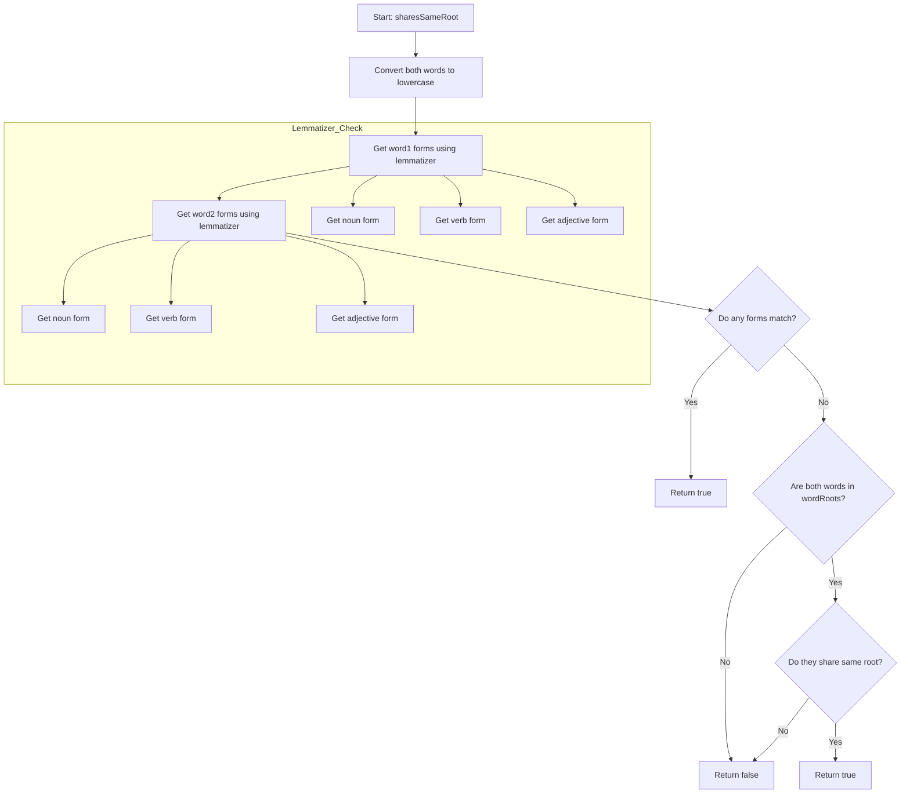

```mermaid
flowchart TD
    A[Start: sharesSameRoot] --> B[Convert both words to lowercase]
    B --> C[Get word1 forms using lemmatizer]
    C --> D[Get word2 forms using lemmatizer]
    D --> E{Do any forms match?}
    E -->|Yes| F[Return true]
    E -->|No| G{Are both words in wordRoots?}
    G -->|No| H[Return false]
    G -->|Yes| I{Do they share same root?}
    I -->|Yes| J[Return true]
    I -->|No| H

    subgraph Lemmatizer_Check
        C --> C1[Get noun form]
        C --> C2[Get verb form]
        C --> C3[Get adjective form]
        D --> D1[Get noun form]
        D --> D2[Get verb form]
        D --> D3[Get adjective form]
    end
```
